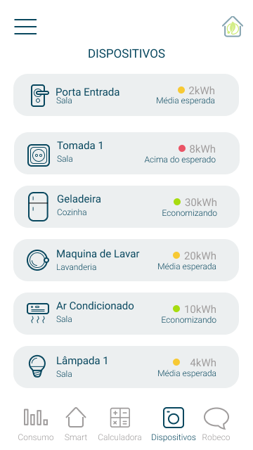

# Call for Code Hackathon

Site do IBM - [Call for Code Hackathon][site]

<h3 align="center">
  <a href="#information_source-o-que-é">O que é?</a>&nbsp;|&nbsp;
  <a href="#information_source-call-for-code">Call for Code</a>&nbsp;|&nbsp;
  <a href="#interrobang-desafio">Desafio</a>&nbsp;|&nbsp;
  <a href="#seedling-Uso">Uso</a>&nbsp;|&nbsp;
  <a href="#rocket-tecnologias-utilizadas">Tecnologias</a>&nbsp;|&nbsp;
  <a href="#iphone-telas">Telas</a>&nbsp;|&nbsp;
  <a href="#heartpulse-equipe">Equipe</a>&nbsp;|&nbsp;
</h3>

## :information_source: O que é?

O Call for Code Hackathon é um evento criativo que tem como objetivo criar soluções escaláveis para todo o mundo sobre problemas causados pela <b>COVID-19 e impactos referente as mudanças climáticas</b>. Serão milhares de pessoas que vão dedicar tempo e conhecimento para “co-criar” esses projetos.

Um ambiente perfeito para criatividade e inovação está sendo criado e durante os 5 dias vamos trabalhar juntos 100% online e home-office.

Durante esse período os participantes terão acesso a mentorias, palestras e conteúdos com diversos especialistas, além disso todos os dias teremos um plantão de dúvidas para ajudar os grupos durante o processo.

## :bulb: Call for code

Codifique e implemente soluções para enfrentar os maiores desafios da sociedade
Junte-se a mais de 210.000 desenvolvedores, cientistas de dados e solucionadores de problemas que se reuniram nos últimos dois anos para criar mais de 8.000 aplicativos no maior desafio tecnológico do gênero

## :heavy_check_mark: Desafio

O desafio deste ano está focado tanto no COVID-19 quanto nas mudanças climáticas. Tudo o que você escolher construir, registre-se para obter acesso gratuito ao IBM Cloud e receba atualizações regulares que lhe darão novas habilidades e ajudarão a acelerar seu desenvolvimento.

Mudanças Climáticas
O gerente de ofertas técnicas da IBM, Sai Vennam, descreve os três kits iniciais para ajudar os desenvolvedores a lidar com as mudanças climáticas por meio do Desafio Global - Call For Code de 2020 e como começar a construir a sua solução.

<h2>Projeto do Time 30 - EFICIÊNCIA ENERGETICA</h2>

## :seedling: Uso 

No diretório do projeto

npm install - isso instala as dependencias

npm start - iniciará o projeto na porta 3000

## :rocket: Tecnologias Utilizadas 

Front-end:
```frond-end
- HTML
- CSS
- JavaScript
- Google Charts
- IBM Cloud ChatBot
```

Template engine: 
```template
- Nunjucks
```

Back-end:
```back
- Node.js
- Express
- Crypto-js
- SQLite
```

Prototipo de tela:
- [Figma][figma]

## :iphone: Telas





## :heartpulse: Equipe

- [Anne K. C. Macedo (Marketing)][karol]
- [Luiz Miyanishi (Desenvolvedor)][luiz]
- Simão R. de Mesquita (Business)
- [Thainá Weingartner (Designer)][thaina]

[figma]:https://www.figma.com/proto/5ooutrgV7i047O3qcwTTaT/2Eco?node-id=0%3A1&scaling=scale-down
[karol]:https://github.com/AnneMacedo
[luiz]:https://github.com/trainningjava
[thaina]:https://github.com/thainaweingartner
[site]:https://callforcode.shawee.io/
