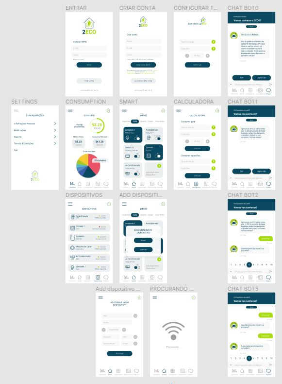

# Code-Hackathon
Call for Code Hackathon

https://callforcode.shawee.io/

<h2>O que é?</h2>

O Call for Code Hackathon é um evento criativo que tem como objetivo criar soluções escaláveis para todo o mundo sobre problemas causados pela <b>COVID-19 e impactos referente as mudanças climáticas</b>. Serão milhares de pessoas que vão dedicar tempo e conhecimento para “co-criar” esses projetos.

Um ambiente perfeito para criatividade e inovação está sendo criado e durante os 5 dias vamos trabalhar juntos 100% online e home-office.

Durante esse período os participantes terão acesso a mentorias, palestras e conteúdos com diversos especialistas, além disso todos os dias teremos um plantão de dúvidas para ajudar os grupos durante o processo.

<b>Call for Code</b>

Codifique e implemente soluções para enfrentar os maiores desafios da sociedade
Junte-se a mais de 210.000 desenvolvedores, cientistas de dados e solucionadores de problemas que se reuniram nos últimos dois anos para criar mais de 8.000 aplicativos no maior desafio tecnológico do gênero

O desafio deste ano está focado tanto no COVID-19 quanto nas mudanças climáticas. Tudo o que você escolher construir, registre-se para obter acesso gratuito ao IBM Cloud e receba atualizações regulares que lhe darão novas habilidades e ajudarão a acelerar seu desenvolvimento.

Mudanças Climáticas
O gerente de ofertas técnicas da IBM, Sai Vennam, descreve os três kits iniciais para ajudar os desenvolvedores a lidar com as mudanças climáticas por meio do Desafio Global - Call For Code de 2020 e como começar a construir a sua solução.

<h2>Uso</h2>

No diretório do projeto

npm install - isso instala as dependencias

npm start - iniciará o projeto na porta 3000

<h2>Técnologias usadas</h2>
Front-end:
- HTML
- CSS
- JavaScript
- Google Charts

Template engine: 
- Nunjucks

Back-end:
- Node.js
- Express
- Crypto-js
- SQLite

Prototipo de tela:
- figma 

Tela 

